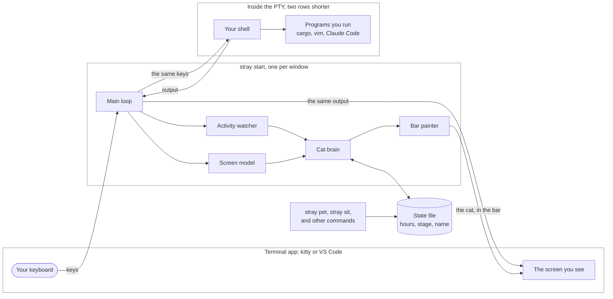
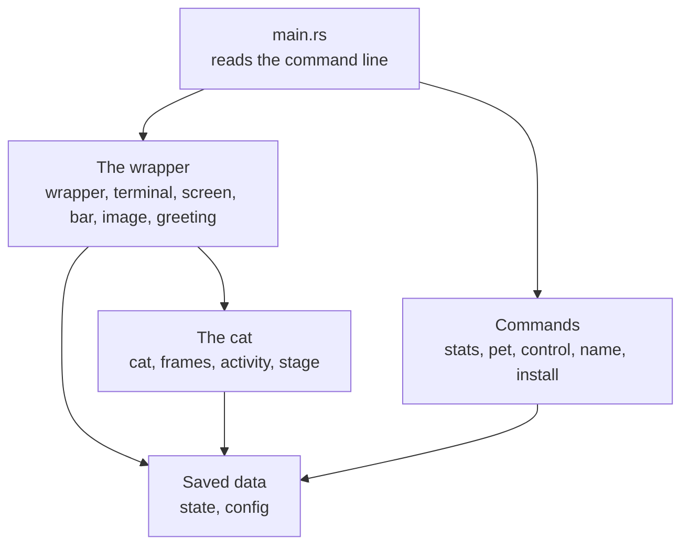
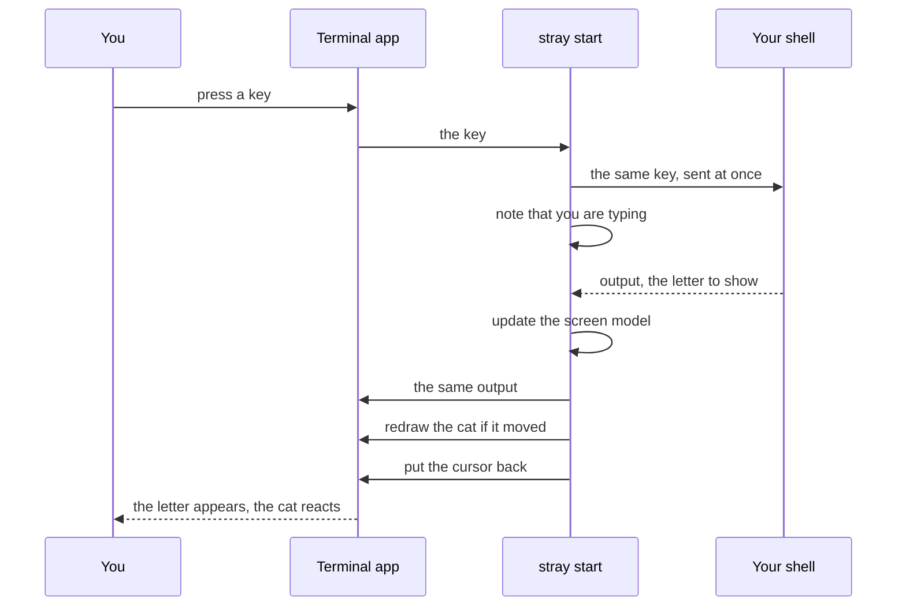
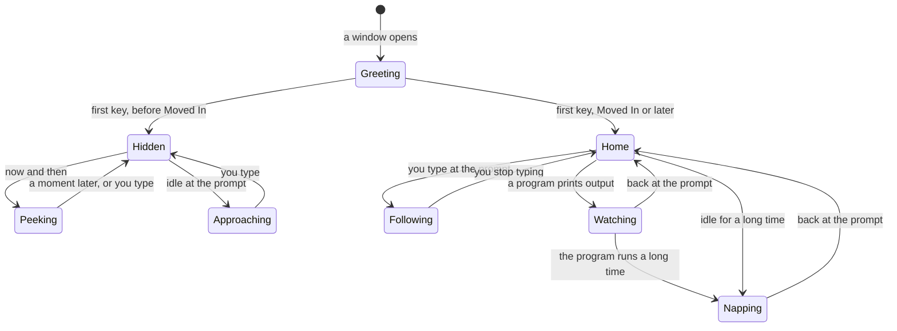
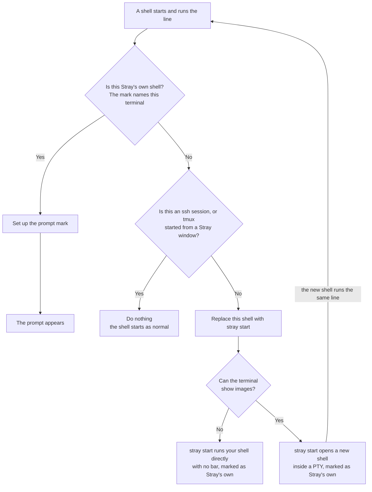

# Architecture

* How Stray works inside, and what every source file will do.
* What the cat does: [DESIGN.md](DESIGN.md). Order of work: [ROADMAP.md](ROADMAP.md).
* Only a small image test is written so far. Plan as of October 2, 2026.

## Contents

1. [Overview](#overview)
2. [Key Terms](#key-terms)
3. [The System At A Glance](#the-system-at-a-glance)
4. [How The Code Is Organized](#how-the-code-is-organized)
5. [A Key From Start To Finish](#a-key-from-start-to-finish)
6. [The Bar](#the-bar)
7. [Knowing What Is Happening](#knowing-what-is-happening)
8. [The Cat Brain](#the-cat-brain)
9. [Drawing The Cat](#drawing-the-cat)
10. [The Launch Greeting](#the-launch-greeting)
11. [Time And Stages](#time-and-stages)
12. [How Commands Reach The Cat](#how-commands-reach-the-cat)
13. [How Stray Starts](#how-stray-starts)
14. [Where Data Is Stored](#where-data-is-stored)
15. [Safety](#safety)
16. [Hard Parts](#hard-parts)
17. [File Reference](#file-reference)

## Overview

* Stray sits between your terminal app and your shell. Every key and every line of output passes through it.
* It tells the shell the terminal is two rows shorter than it is, and draws the cat in those rows.

1. **Pass everything through.** Keys and output are forwarded as they are.
2. **Keys first.** A key goes to the shell before the cat reacts.
3. **Draw only on change.** If the cat has not moved, Stray draws nothing.

## Key Terms

| Term | Meaning |
| --- | --- |
| **Terminal app** | The window program: kitty, or the terminal in VS Code. |
| **Shell** | The program that reads your commands: bash or zsh. |
| **PTY** | A pretend terminal one program makes for another. |
| **Wrapper** | The running `stray start` program. One per window. |
| **Bar** | The bottom two rows, kept for the cat. |
| **Escape code** | A hidden instruction in terminal output, such as "clear the screen". |
| **Scroll region** | The rows a terminal is allowed to scroll. |
| **Screen model** | Stray's own copy of what is on the screen. |
| **Prompt mark** | A private escape code the shell prints before each prompt. |
| **Foreground program** | The program that owns the terminal right now. |
| **Frame** | One small picture of the cat. |
| **Image protocol** | The escape codes kitty invented for showing pictures. |
| **Image check** | Asking the terminal whether it understands the image protocol. |
| **State file** | The saved hours, name, and settings shared by every window. |
| **Batched update** | A program asking the terminal to show many changes at once, so the screen does not flicker. Claude Code does this. |
| **Passthrough** | A tmux setting that lets image codes go through tmux to the terminal app. |
| **Placeholder** | A special text character that stands in for one cell of an image. Used inside tmux. |

## The System At A Glance



* No network. Windows share only the state file.

## How The Code Is Organized

* One Rust package, `stray-cat`, that builds one program, `stray`.
* Needs Rust 1.89 or newer, for the file lock built into Rust.



| Group | Role |
| --- | --- |
| **The wrapper** | Runs the shell in a PTY, passes data, keeps the bar safe, and draws. |
| **The cat** | Decides what the cat does. Knows nothing about terminals, so it tests without one. |
| **Saved data** | Loads and saves the state and settings files. |
| **Commands** | The short commands you type. |

## A Key From Start To Finish



* The main loop waits on keys, shell output, and a timer. The timer stops when the cat is still.

## The Bar

### Reserving The Rows

1. Stray reads the terminal size. Say 40 rows.
2. It creates the PTY with 38 rows.
3. It tells the terminal app to scroll only rows 1 to 38.
4. It draws the bar in rows 39 and 40.

* Row 1 stays row 1, so no positions in the output need changing.
* Text that scrolls off the top still goes into the terminal's history.

### Keeping The Bar Safe

| What Happens | The Damage | What Stray Does |
| --- | --- | --- |
| A program clears the screen | The bar and the cat are wiped. | Draws the bar and places the cat again. |
| A program resets the scroll region | The bar can scroll away. | Swaps the reset for its own region before it reaches the terminal. |
| A program moves the cursor to a row past 38, for example to find the screen size | It would write in the bar. | Changes the move so it stops at row 38. |
| A full screen view opens or closes | The new view has no bar. | Sets the region and draws again. |
| The terminal is reset | Everything is wiped. | Sets the region and draws again. |
| The window is resized | The rows move. | Gives the PTY the new size less two rows, sets the region, and draws again. |
| The window is shorter than 10 rows | No room. | Turns the bar off until the window grows. |

## Knowing What Is Happening

| Signal | How Stray Gets It | What It Tells The Cat |
| --- | --- | --- |
| **Prompt mark** | The shell prints it before each prompt, with whether the last command failed. Stray removes it from the output. | A prompt was drawn, where, and whether to flinch. |
| **Foreground program** | Stray asks the PTY which program is in front and looks up its name and command line with `sysinfo`. This works the same on macOS and Linux. | The shell is waiting, or a program is running, and which one. |
| **Keys** | Stray sees every key. | You are typing, or how long you have been idle. |
| **Output** | Stray sees all output. | Something is printing, or the screen is quiet. |
| **Full screen flag** | The screen model has it. | A program such as `vim` has the screen. |

* Any bytes from the keyboard count as a key. Stray does not work out which key.
* Idle means the shell is in front, with no keys and no output for a set time.
* A coding agent is found by name: `claude` or `codex`.
* `tmux` and `ssh` are found by name too. The cat treats them like any other program.

## The Cat Brain



| Stage | Modes Allowed |
| --- | --- |
| Scared | Greeting, Hidden |
| Peeking | Greeting, Hidden, Peeking |
| Curious | Greeting, Hidden, Peeking, Approaching |
| Moved In and later | Greeting, Home, Following, Watching, Napping |

* `stray sit`, `stray quiet`, and `stray hide` pin the cat in one mode until `stray come`.
* Each tick, the brain returns a frame, a column in the bar, and whether anything changed.

### Resting Actions

* In the Home mode, the brain picks an action at random by weight, runs it for a set time, then picks again.

| Action | Starting Weight | Movement |
| --- | --- | --- |
| Sit | 50 | None. |
| Sleep | 25 | None. The weight grows with idle time. |
| Walk | 12 | Across the bar and back, slowly. |
| Play | 9 | In place. |
| Run | 4 | Across the bar, fast. |

* Weights and times live in the settings file.
* Any key ends Sleep. A program starting ends every action.

## Drawing The Cat

* Stray uses two actions of the image protocol: send a frame and show it, and remove it. VS Code supports both.
* It does not place an uploaded frame again by its ID. In VS Code, removing a frame from the screen also deletes the picture, so it cannot be placed again. The image test showed this.

### Once, At Startup

1. Ask the terminal for its text color.
2. Color the frames built into the program, and make a flipped copy of each.
3. Keep every frame in memory, ready to send.

### On Each Change

1. Move to the cat's spot in the bar.
2. Send the new frame and show it there, scaled to the height of the bar. Two IDs take turns.
3. Remove the old frame and its picture.
4. Put the cursor back.

* Showing the new frame before removing the old one means there is never a moment with no cat.
* One frame is about 30 KB of text. The cat changes only a few times a second at most, so this is small.
* Every image command tells the terminal not to answer. An answer would arrive as typed keys.
* Each wrapper picks its own random range of frame IDs, and removes only its own frames. Other programs' images and the cats in other tmux panes are safe.
* Stray restores the cursor from the screen model. It does not use the terminal's one "save the cursor" slot, because programs do.

### Only Between Pieces Of Output

* Stray adds its own drawing only at a clean break in the output.
* It never cuts into an escape code or into a character that takes more than one byte.
* During a batched update, it waits until the batch ends, then draws.

### Inside tmux

* tmux does not know about images. A placed image would stay where it is when you switch panes or windows.

1. Stray wraps each image code so tmux passes it through to the terminal app.
2. It uploads the frames the same way as outside tmux.
3. To show a frame, it prints placeholders in the bar instead of placing the image at a spot.
4. tmux treats the placeholders as text, so the cat moves and hides with its pane.

* kitty supports placeholders. Other terminals are untested inside tmux.

## The Launch Greeting

1. Wait for the first prompt mark. This skips anything the shell prints while starting.
2. Check the screen model. The space where the cat would sit must be empty.
3. Place the cat's frame next to the cursor, just after the `>`.
4. On the first key, remove the frame, then forward the key.
5. Run the cat fast down the empty rows into the bar.

* This is the same at every stage. Only where the run ends changes: hidden past the edge, or in the home corner.
* If the space is not empty, or the window is resized, the cat starts in the bar.

## Time And Stages

1. About once a minute, a wrapper locks the state file.
2. It reads the time of the last count.
3. If a minute or more has passed, it adds that time to the total.
4. If another window already counted this minute, it adds nothing.
5. It unlocks the file.

* A gap longer than a few minutes, such as a sleeping laptop, is not counted.
* The stage is never saved. It is worked out from the hours and the settings each time.

## How Commands Reach The Cat

1. A command such as `stray sit` changes the state file and exits.
2. Every wrapper checks a few times a second whether the file changed.
3. When it has, the wrapper loads it and the cat reacts.

* This is why a command applies in every window.
* `sit`, `quiet`, and `hide` are saved as the cat's current mode.
* `stray pet` is a one time event, so it saves the time it was run. Each wrapper sees a newer time than the last one it saw and plays the petting reaction once.

## How Stray Starts

* `stray install` adds one line to `~/.zshrc` or `~/.bashrc`:

```sh
command -v stray >/dev/null && eval "$(stray init zsh)"
```



* The mark is an environment variable that holds the name of Stray's PTY, such as `/dev/ttys004`.
* A shell is Stray's own only when the mark matches its own terminal. A copy of the mark that leaked into another program does not count.
* So running `code .` or opening a new kitty window from a Stray shell still gives the new window its own Stray.
* An ssh session is found by the `SSH_CONNECTION` variable that ssh sets.
* tmux started from a Stray window is found by the `TMUX` variable together with a leaked mark.
* If the `stray` program was deleted, the line does nothing and the shell starts as normal.

### The Inner Shell

* The new shell starts as a login shell when the first one was.
* macOS terminals always start login shells, and files such as `~/.zprofile` must still run.
* The new shell gets the same arguments and the same environment, plus the mark.

### The Image Check

1. `stray start` sends a tiny test picture, marked "check only, do not show".
2. It then sends a standard question that every terminal answers.
3. An OK for the picture before that answer means yes.
4. Only the standard answer means no.

* Inside tmux, the test picture is wrapped for passthrough like every other image code.
* If no answer comes back within a short time, that also means no.
* On the first no, Stray prints one line that says why, saves that it did, and stays silent after that. Inside tmux, the line names the `allow-passthrough` setting.
* Stray never looks at the terminal's name.

## Where Data Is Stored

* Standard folders, found with the `directories` crate. No fixed paths.

| What | File | Holds |
| --- | --- | --- |
| Settings | `config.toml` in the config folder | Stage hours, bar height, idle times, action weights, and the test speed. |
| State | `state.json` in the data folder | Total time, the time of the last count, the cat's name, whether it is sitting, quiet, or hidden, the time of the last pet, and whether the image hint was shown. |

* The state file is written to a new file and swapped in, so a crash cannot leave it half written.

## Safety

* **Fails open.** If anything goes wrong while starting, `stray start` runs your shell directly.
* **Cleans up after a crash.** If Stray crashes after the shell has started, the shell ends with it. Before it exits, Stray puts the terminal back to normal, removes its frames, and prints one line that says what happened.
* **Does not read your work.** Output is used only to follow the cursor, clears, and the prompt mark. None is saved.
* **Does not record commands.** The state file holds time, a name, and a few settings.
* **Unknown escape codes pass through.** Features such as VS Code shell integration keep working.
* **No network.**
* **Keeps the exit code.** `stray start` exits with the shell's own code.

## Hard Parts

* None of these is tested yet.

| Problem | Plan |
| --- | --- |
| An escape code can arrive split across two reads. | Hold back an unfinished code until the rest arrives. |
| kitty and VS Code may treat the scroll region differently. | Test the bar in both from its first day. |
| Coding agents redraw the screen often. | Redraw the bar after any output that could have touched it. |
| Tools that run on Node may show the name `node`. | Look at the full command line. |
| A resize can reflow old text into the bar. | Draw the full bar again after every resize. |
| VS Code's image support is new and has gaps. | Send each frame again instead of placing it by ID. The image test showed this works in kitty and VS Code. |
| Swapping frames may flicker. | Show the new frame before removing the old one. No flicker in the image test. |
| A program inside the shell may show its own images. | Random ID ranges, and remove only Stray's frames. |
| Programs can move the cursor into the bar. | Stop every move at the last shell row. |
| Drawing in the middle of a batched update can tear the screen. | Wait for the batch to end. |
| Placed images do not move with tmux panes. | Use placeholders inside tmux. |
| Placeholders may only work in kitty. | Test them in kitty first. Treat other terminals as untested inside tmux. |
| tmux may have passthrough off. | The image check fails and the hint names the setting. |

## File Reference

```
stray/
├── Cargo.toml             the package stray-cat and the program stray
├── src/
│   ├── main.rs            reads the command line and calls the matching command
│   ├── wrapper.rs         stray start: the PTY and the main loop
│   ├── terminal.rs        the real terminal: raw input, size, and resize
│   ├── screen.rs          the screen model and the checks that keep the bar safe
│   ├── bar.rs             reserves the rows and draws the bar
│   ├── image.rs           the image protocol: check, send, remove, and tmux
│   ├── greeting.rs        the cat at the prompt on launch
│   ├── cat.rs             the cat brain: modes, actions, and movement
│   ├── frames.rs          the cat's frames and the habitat items
│   ├── activity.rs        the five signals, turned into plain facts
│   ├── stage.rs           hours to stage
│   ├── state.rs           the state file: load, save, lock, and count time
│   ├── config.rs          the settings file and its defaults
│   ├── shell.rs           the startup line and the scripts for bash and zsh
│   ├── commands/          one file per command
│   └── bin/
│       └── stray-image-test.rs   Phase 0 only: the image test
└── docs/                  design, architecture, and roadmap
```

| File | Purpose | Uses |
| --- | --- | --- |
| `main.rs` | Reads the command line with `clap`. | every command, `wrapper` |
| `wrapper.rs` | Runs the image check and the shell in a PTY. Owns the main loop. | `terminal`, `screen`, `image`, `bar`, `greeting`, `cat`, `activity`, `state` |
| `terminal.rs` | Raw mode, size, and resizes of the real terminal. Restores it on exit. | none |
| `screen.rs` | The screen model. Spots clears, region resets, full screen views, and batched updates. Stops cursor moves into the bar. Removes the prompt mark. | none |
| `bar.rs` | Sets the scroll region, draws the bar, and restores the cursor. | `screen`, `image`, `frames` |
| `image.rs` | The image check. Sends, shows, and removes frames. Inside tmux, wraps codes for passthrough and prints placeholders. | none |
| `greeting.rs` | Places the cat at the prompt and runs it to the bar. | `screen`, `image`, `frames` |
| `cat.rs` | Picks the mode, resting action, position, and frame. | `activity`, `stage`, `frames` |
| `frames.rs` | Holds every frame. Colors and flips them. | none |
| `activity.rs` | Tracks typing, idle time, output, and the foreground program. | none |
| `stage.rs` | Turns hours into a stage. | `config` |
| `state.rs` | Loads, saves, and locks the state file. Counts each minute once. | `config` |
| `config.rs` | Reads the settings file and supplies defaults. | none |
| `shell.rs` | The scripts for `stray init`, the startup line, and the checks for the mark, ssh, and tmux. | none |

### Commands

| File | Command | Uses |
| --- | --- | --- |
| `commands/stats.rs` | `stray stats` | `state`, `stage` |
| `commands/pet.rs` | `stray pet` | `state`, `stage` |
| `commands/control.rs` | `stray sit`, `stray quiet`, `stray hide`, and `stray come` | `state` |
| `commands/name.rs` | `stray name` | `state` |
| `commands/install.rs` | `stray install` and `stray uninstall` | `shell` |

* `stray start` and `stray init` are hidden helpers. You never type them.

### Libraries

| Crate | Used For |
| --- | --- |
| `portable-pty` | The PTY, the shell inside it, resizing, and the foreground program. |
| `vt100` | The screen model. |
| `crossterm` | Raw mode and the size of the real terminal. |
| `png` | Reading the frames built into the program. |
| `base64` | Preparing frames to send to the terminal. |
| `clap` | Reading the command line. |
| `serde`, `serde_json`, and `toml` | The state and settings files. |
| `directories` | Finding the config and data folders. |
| `sysinfo` | The name and command line of the foreground program, on macOS and Linux. |
| `anyhow` | Errors. |

### Tests

* Unit tests sit at the bottom of the file they test.
* `cat.rs`, `stage.rs`, and `state.rs` need no terminal, so most rules are tested there.
* `screen.rs` is tested by feeding it recorded output.
