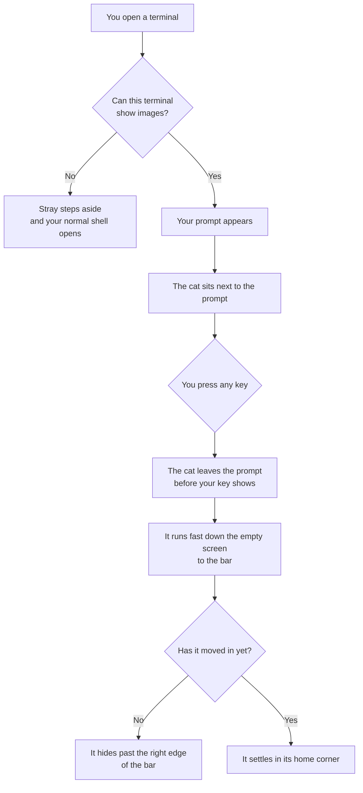
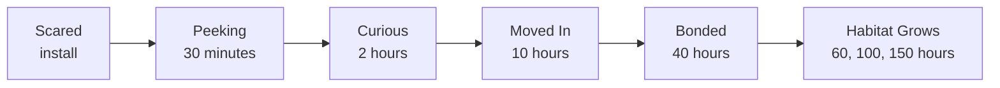

# Design

* What Stray is and how the cat behaves.
* How it is built: [ARCHITECTURE.md](ARCHITECTURE.md). What comes next: [ROADMAP.md](ROADMAP.md).
* Only a small image test is written so far. Plan as of October 2, 2026.

## Contents

1. [Overview](#overview)
2. [Key Terms](#key-terms)
3. [The Screen](#the-screen)
4. [The First Launch](#the-first-launch)
5. [How Time Is Counted](#how-time-is-counted)
6. [The Stages](#the-stages)
7. [At The Prompt](#at-the-prompt)
8. [At Rest](#at-rest)
9. [While Programs Run](#while-programs-run)
10. [The Cat's Look](#the-cats-look)
11. [The Habitat](#the-habitat)
12. [Commands](#commands)
13. [Install And Remove](#install-and-remove)
14. [Supported Terminals](#supported-terminals)
15. [tmux And ssh](#tmux-and-ssh)
16. [Rules That Do Not Change](#rules-that-do-not-change)
17. [Decisions](#decisions)
18. [Left For Later](#left-for-later)
19. [Open Questions](#open-questions)

## Overview

* Stray is a small cat that lives in your terminal.
* It starts afraid of you. The more hours your terminal is open, the more it trusts you.
* It also counts your terminal hours, shown by `stray stats`.

1. **The terminal comes first.** The cat never slows typing or covers your work.
2. **The relationship is earned.** Only time unlocks a stage.
3. **It is easy to quiet.** One command makes the cat sit, sleep, or leave.

## Key Terms

| Term | Meaning |
| --- | --- |
| **Bar** | The bottom two rows of the terminal. They belong to the cat. |
| **Home corner** | The right end of the bar, where the cat rests and hides. |
| **Prompt** | The line where your shell waits for a command. |
| **Greeting** | The cat sitting by your prompt at launch. |
| **Hours** | Total time your terminal has been open with Stray running. |
| **Stage** | How much the cat trusts you. It depends only on hours. |
| **Idle** | The shell is waiting at the prompt and you have not typed for a while. |
| **Frame** | One small picture of the cat. |
| **Image check** | Stray asking the terminal at launch whether it can show images. |
| **Pane** | One of the split areas inside a tmux window. |

## The Screen

```
+----------------------------------------------------+
| ~/code > cargo build                               |
|    Compiling stray-cat v0.1.0                      |
|     Finished in 4.2s                               |   your shell and
| ~/code > _                                         |   your programs
|                                                    |
|                                                    |
+----------------------------------------------------+
|                                            /\_/\   |   the bar: two rows
|                                           ( o.o )  |   for the cat
+----------------------------------------------------+
```

* The cat is shown as text here. The real cat is a small image.
* Programs never draw in the bar. They do not know it exists.
* In a window too short to share, the bar turns off.

## The First Launch



* The cat sits by the `>` of your prompt and waits.
* At every stage, it runs fast as soon as you press the first key. Your typing never lands under the cat.
* The greeting only happens on an empty screen, so nothing is under the cat.

## How Time Is Counted

* Time counts whenever a terminal is open with Stray running.
* Several windows open at once count once.
* Stray counts time only. It never records what you type or run.

## The Stages



| Stage | Starts At | What You See |
| --- | --- | --- |
| **Scared** | Install | The cat greets you, runs when you type, and stays hidden. |
| **Peeking** | 30 minutes | Its head appears at the right edge of the bar now and then. |
| **Curious** | 2 hours | When you are idle, it walks toward your cursor. It backs away when you type. |
| **Moved In** | 10 hours | It lives in the bar and follows your typing. |
| **Bonded** | 40 hours | Petting unlocks. It stays close while you type. |
| **Habitat Grows** | 60, 100, and 150 hours | One new item appears in the bar at each step. |

* The hours are starting numbers in a settings file. A speed setting makes them pass faster for testing.

## At The Prompt

| Stage | When You Type | When You Are Idle |
| --- | --- | --- |
| Scared | Stays hidden. | Stays hidden. |
| Peeking | Pulls its head back. | Peeks out now and then. |
| Curious | Backs away to the edge. | Walks along the bar to the spot under your cursor. |
| Moved In | Follows your cursor along the bar. Pounces on Enter. | Picks a resting action. |
| Bonded | Stays under your cursor. | Picks a resting action, and can be petted. |

* The cat moves along the bar. It does not climb into your text.

## At Rest

| Action | What You See | How Often |
| --- | --- | --- |
| **Sit** | Still, with a blink or tail flick. | Most of the time |
| **Sleep** | Curled up, breathing slowly. | Often, more after long idle time |
| **Walk** | A stroll across the bar and back. | Sometimes |
| **Play** | Bats at something, or pounces. | Sometimes |
| **Run** | A dash from one end of the bar to the other. | Rarely |

* From Moved In onward, the cat picks an action, does it for a while, then picks again.
* Typing wakes a sleeping cat. `stray sit` and `stray quiet` turn the actions off.

## While Programs Run

* When anything other than your shell is running, the cat stays in the bar. Programs redraw the screen and would erase it.

| What Is Happening | What The Cat Does |
| --- | --- |
| Output is scrolling by | Sits and watches. |
| A program has run for a long time | Naps. |
| A coding agent stops and waits for you | Perks up. |
| A command fails | Flinches. |
| A full screen program such as `vim` is open | Sits still. |

* Before Moved In, the cat stays hidden while programs run.
* tmux and ssh count as programs too. See [tmux And ssh](#tmux-and-ssh).

## The Cat's Look

* A single color silhouette, in the style of the RunCat menu bar cat, and a little bigger.
* It fills the two rows of the bar, scaled to your font size.
* It takes the color of your terminal's text.
* It is drawn facing one way. Stray flips it to face the other.
* The art is original. No frames are copied from RunCat.

| Pose | Frames | Used For |
| --- | --- | --- |
| Running | About 5 | The dash from the prompt, and the run action. |
| Walking | None of its own | The running frames, played slower. |
| Sitting | 1 or 2 | Resting, watching, and peeking. |
| Sleeping | 2 | Naps. |
| Playing | 3 or 4 | The play action. |
| Reactions | 3 | Flinching, perking up, and being petted. |

* About 15 to 18 frames in total. None are drawn yet. The image test uses a placeholder cat.

## The Habitat

* One item appears in the bar at 60, 100, and 150 hours.
* The first is a bed in the home corner. The others are not chosen yet.
* Items are small images in the same style as the cat. The cat uses them.

## Commands

| Command | Does |
| --- | --- |
| `stray stats` | Shows total hours, the stage, and the time until the next stage. |
| `stray pet` | Pets the cat once it is bonded. Before that, the cat backs away. |
| `stray sit` | The cat stays where it is. |
| `stray quiet` | The cat sleeps and nothing moves. |
| `stray hide` | The cat leaves. The bar stays empty. |
| `stray come` | Calls the cat back. Ends `sit`, `quiet`, and `hide`. |
| `stray name <name>` | Names the cat. |
| `stray install` | Adds Stray to your shell. |
| `stray uninstall` | Removes Stray from your shell. Your hours are kept. |

* There is one cat, so a command applies in every window.

## Install And Remove

1. Get the program:

   ```sh
   cargo install stray-cat
   ```

2. Add it to your shell:

   ```sh
   stray install
   ```

3. Open a new terminal.

* `stray install` adds one line to the startup file of bash or zsh.
* In VS Code, also turn on `terminal.integrated.enableImages`.
* In tmux, also add `set -g allow-passthrough on` to `~/.tmux.conf`. `stray install` tells you if it is missing. It never edits that file.
* The package is `stray-cat` because `stray` was taken on crates.io. The command is `stray`.

## Supported Terminals

* Stray runs on macOS and Linux. macOS is tested in every phase.
* At launch, Stray asks the terminal whether it can show images.
* Yes: Stray runs. No: Stray steps aside and your normal shell opens.
* There is no text version of the cat.

| Terminal | Status |
| --- | --- |
| kitty | Main target. Tested in every phase. |
| VS Code terminal | Tested in every phase. Needs version 1.110 or newer, with `terminal.integrated.enableImages` on. |
| iTerm2, Ghostty, WezTerm, and Warp | Should work. Untested. |
| Terminals that cannot show images, such as the macOS Terminal app | Not supported. |

* The first time a terminal says no, Stray prints one line that says why. After that it stays silent.
* Hours are not counted where Stray stepped aside.

## tmux And ssh

* There is one cat, and it lives on your own machine. tmux and ssh never add a second cat to the same screen.

| Where You Are | What Happens |
| --- | --- |
| tmux started from a Stray window | tmux is a program like any other. The cat stays in the window's bar and sits still. The panes get no cat of their own. |
| tmux started on its own | Each pane gets its own bar with the same cat. Needs tmux 3.3 or newer with `allow-passthrough` on. |
| ssh from a Stray window | ssh is a program like any other. The cat watches from your bar, and naps when nothing happens for a while. |
| A shell on the far machine | If Stray is installed there too, it steps aside. |

* If tmux has `allow-passthrough` off, the image check says no and Stray steps aside. The one line it prints names the setting.
* Hours count the same way inside tmux. Many panes open at once count once.

## Rules That Do Not Change

1. **The terminal comes first.** Every key reaches your shell before the cat reacts.
2. **The cat never covers your work.** It leaves the bar only for the greeting, onto empty space.
3. **A broken Stray never locks you out.** If it cannot start, your normal shell opens. If it crashes later, your terminal is put back the way it was.
4. **Easy to quiet, easy to remove.** One command each.
5. **Nothing leaves your machine.** No network and no account.
6. **One way to draw.** The cat is always an image.
7. **One cat.** Every window shows the same cat and the same stage.

## Decisions

| Decision | Why | What It Costs |
| --- | --- | --- |
| Bar at the bottom | Scrolling back keeps working, and the prompt is usually just above. | In a fresh window the prompt is far from the bar. |
| Bar is two rows | Room for the cat and a habitat. | Less space in short panels. |
| Time counts while the terminal is open | Easy to understand and build. | A terminal left open all night earns hours. |
| Stray runs your shell inside itself | The only way to animate while you type. | Harder to build. |
| Image only, no text cat | A smooth cat and one way to draw. | Terminals without images get nothing. |
| The greeting ends at the first key, at every stage | Your typing is never under the cat. | The cat never lingers at the prompt. |
| Petting is a command | Works everywhere. | Less playful than the mouse. |
| Cat stays in the bar while programs run | Programs would erase it. | Less movement inside coding agents. |
| Command `stray`, package `stray-cat` | The short name was taken. | Two names at install. |
| One cat per screen with tmux and ssh | Two cats on one screen would fight over it. | A far machine never gets a cat of its own. |

## Left For Later

* Petting with the mouse.
* The cat stepping out of the bar toward an idle prompt.
* Trust that fades after a long time away.
* Other shells, such as fish.
* Testing iTerm2, Ghostty, and other terminals that pass the image check.

## Open Questions

1. What are the other plans for the bar?
2. What are the last two habitat items?
3. Should `stray hide` give the two rows back to the shell?
4. How long is idle before the cat approaches, and before it naps? First guess: 20 seconds and 5 minutes.
5. Who draws the final frames?
6. Is two rows tall enough for the cat, or should the bar be three?
