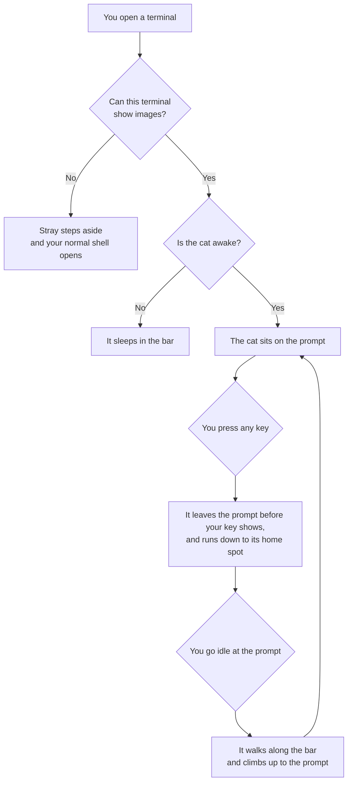

# Design

* What Stray is and how the cat behaves.
* How it is built: [ARCHITECTURE.md](ARCHITECTURE.md). What comes next: [ROADMAP.md](ROADMAP.md).
* Only a small image test is written so far. Plan as of October 5, 2026.

## Contents

1. [Overview](#overview)
2. [Key Terms](#key-terms)
3. [The Screen](#the-screen)
4. [At The Prompt](#at-the-prompt)
5. [The Cat's Day](#the-cats-day)
6. [At Rest](#at-rest)
7. [While Programs Run](#while-programs-run)
8. [The Cat's Look](#the-cats-look)
9. [Commands](#commands)
10. [Naming The Cat](#naming-the-cat)
11. [Install And Remove](#install-and-remove)
12. [Supported Terminals](#supported-terminals)
13. [tmux And ssh](#tmux-and-ssh)
14. [Rules That Do Not Change](#rules-that-do-not-change)
15. [Decisions](#decisions)
16. [Left For Later](#left-for-later)
17. [Open Questions](#open-questions)

## Overview

* Stray is a small cat that lives in your terminal.
* It sits on your prompt. When you type, it runs down to its spot at the bottom of the screen. When you stop, it comes back.
* It keeps its own day by the clock: it eats, naps, and sleeps at set times.
* You can give it a treat, pet it, and name it.

1. **The terminal comes first.** The cat never slows typing or covers your work.
2. **Simple to live with.** Nothing to earn, nothing to keep up with. It is your cat from the first day.
3. **It is easy to quiet.** One command puts the cat to sleep.

## Key Terms

| Term | Meaning |
| --- | --- |
| **Bar** | The bottom two rows of the terminal. They belong to the cat. |
| **Home spot** | The right end of the bar, where the cat rests. |
| **Prompt** | The line where your shell waits for a command. |
| **Greeting** | The cat sitting on your prompt when a window opens. |
| **Idle** | The shell is waiting at the prompt and you have not typed for a while. |
| **Schedule** | The times of day the cat eats, naps, and sleeps. |
| **Frame** | One small picture of the cat. |
| **Image check** | Stray asking the terminal at launch whether it can show images. |
| **Pane** | One of the split areas inside a tmux window. |

## The Screen

```
+----------------------------------------------------+
| ~/code > cargo build                               |
|    Compiling stray-cat v0.1.0                      |
|     Finished in 4.2s                               |   your shell and
| ~/code > _                                         |   your programs
|                                                    |
|                                                    |
+----------------------------------------------------+
|                                            /\_/\   |   the bar: two rows
|                                           ( o.o )  |   for the cat
+----------------------------------------------------+
```

* The cat is shown as text here. The real cat is a small image.
* Programs never draw in the bar. They do not know it exists.
* In a window too short to share, the bar turns off.

## At The Prompt



* The cat sits just after the `>` of your prompt and waits.
* It runs as soon as you press a key. Your typing never lands under the cat.
* After about 30 seconds idle at the prompt, it comes back up and sits on the `>` again.
* It moves only through empty rows below the prompt. It never walks over your text.
* It comes up only when the space after the `>` is empty and it is awake and not busy.
* Output, a resize, or a program starting also sends it back down.

## The Cat's Day

* The cat follows the clock on your computer. Every day is the same.

| Time | What The Cat Does |
| --- | --- |
| 7 to 9 am | **Breakfast.** It eats from its bowl in the bar. |
| 1 to 3 pm | **Nap.** It sleeps in the bar. |
| 6 to 7 pm | **Dinner.** It eats from its bowl in the bar. |
| 11 pm to 7 am | **Night.** It sleeps in the bar. |
| Any other time | **Free time.** It greets you, comes to the prompt, and picks a resting action. |

* A meal lasts a few minutes, at the start of meal time or when you open a window during it. Then it is free time.
* A sleeping cat stays in the bar. It does not greet you or come to the prompt, and typing does not wake it.
* The times are starting numbers in a settings file.

## At Rest

* In free time, while it sits in the bar, the cat picks an action, does it for a while, then picks again.

| Action | What You See | How Often |
| --- | --- | --- |
| **Sit** | Still, with a blink or tail flick. | Most of the time |
| **Walk** | A stroll across the bar and back. | Sometimes |
| **Play** | Bats at something, or pounces. | Sometimes |
| **Run** | A dash from one end of the bar to the other. | Rarely |

## While Programs Run

* When anything other than your shell is running, the cat stays in the bar. Programs redraw the screen and would erase it.

| What Is Happening | What The Cat Does |
| --- | --- |
| Output is scrolling by | Sits and watches. |
| A program has run for a long time | Naps until you are back at the prompt. |
| A coding agent stops and waits for you | Perks up. |
| A command fails | Flinches. |
| A full screen program such as `vim` is open | Sits still. |

* tmux and ssh count as programs too. See [tmux And ssh](#tmux-and-ssh).

## The Cat's Look

* A single color silhouette, in the style of the RunCat menu bar cat, and a little bigger.
* It fills the two rows of the bar, scaled to your font size.
* It takes the color of your terminal's text.
* It is drawn facing one way. Stray flips it to face the other.
* The art is original. No frames are copied from RunCat.

| Pose | Frames | Used For |
| --- | --- | --- |
| Running | About 5 | Running down from the prompt, and the run action. |
| Walking | None of its own | The running frames, played slower. |
| Climbing | 1 or 2 | Coming up to the prompt. |
| Sitting | 1 or 2 | The prompt, resting, and watching. |
| Eating | 2 | Meals and treats, with a small bowl. |
| Sleeping | 2 | Naps and night. |
| Playing | 3 or 4 | The play action. |
| Reactions | 3 | Flinching, perking up, and being petted. |

* About 17 to 20 frames in total. None are drawn yet. The image test uses a placeholder cat.

## Commands

| Command | Does |
| --- | --- |
| `stray treat` | Gives the cat a treat. It eats it, even if it was asleep, then goes back to what it was doing. |
| `stray pet` | Pets the cat. It purrs. A sleeping cat purrs in its sleep. |
| `stray name <name>` | Names the cat. See [Naming The Cat](#naming-the-cat). |
| `stray quiet` | The cat sleeps in the bar and nothing moves. |
| `stray come` | Wakes the cat. Ends `quiet`. |
| `stray install` | Adds Stray to your shell. |
| `stray uninstall` | Removes Stray from your shell. |

* There is one cat, so a command applies in every window.

## Naming The Cat

* `stray name mochi` names the cat Mochi.
* In windows you open after that, `mochi` works in place of `stray`. For example, `mochi treat`.
* `stray` always keeps working.
* The name must be one word: letters, numbers, and dashes.
* If you already have a command with that name, Stray says so and does not add it.

## Install And Remove

1. Get the program:

   ```sh
   cargo install stray-cat
   ```

2. Add it to your shell:

   ```sh
   stray install
   ```

3. Open a new terminal.

* `stray install` adds one line to the startup file of bash or zsh.
* In VS Code, also turn on `terminal.integrated.enableImages`.
* In tmux, also add `set -g allow-passthrough on` to `~/.tmux.conf`. `stray install` tells you if it is missing. It never edits that file.
* The package is `stray-cat` because `stray` was taken on crates.io. The command is `stray`.

## Supported Terminals

* Stray runs on macOS and Linux. macOS is tested in every phase.
* At launch, Stray asks the terminal whether it can show images.
* Yes: Stray runs. No: Stray steps aside and your normal shell opens.
* There is no text version of the cat.

| Terminal | Status |
| --- | --- |
| kitty | Main target. Tested in every phase. |
| VS Code terminal | Tested in every phase. Needs version 1.110 or newer, with `terminal.integrated.enableImages` on. |
| iTerm2, Ghostty, WezTerm, and Warp | Should work. Untested. |
| Terminals that cannot show images, such as the macOS Terminal app | Not supported. |

* The first time a terminal says no, Stray prints one line that says why. After that it stays silent.

## tmux And ssh

* There is one cat, and it lives on your own machine. tmux and ssh never add a second cat to the same screen.

| Where You Are | What Happens |
| --- | --- |
| tmux started from a Stray window | tmux is a program like any other. The cat stays in the window's bar. The panes get no cat of their own. |
| tmux started on its own | Each pane gets its own bar with the same cat. Needs tmux 3.3 or newer with `allow-passthrough` on. |
| ssh from a Stray window | ssh is a program like any other. The cat watches from your bar, and naps when nothing happens for a while. |
| A shell on the far machine | If Stray is installed there too, it steps aside. |

* If tmux has `allow-passthrough` off, the image check says no and Stray steps aside. The one line it prints names the setting.

## Rules That Do Not Change

1. **The terminal comes first.** Every key reaches your shell before the cat reacts.
2. **The cat never covers your work.** It leaves the bar only for the prompt, and only through empty space.
3. **A broken Stray never locks you out.** If it cannot start, your normal shell opens. If it crashes later, your terminal is put back the way it was.
4. **Easy to quiet, easy to remove.** One command each.
5. **Nothing leaves your machine.** No network and no account.
6. **One way to draw.** The cat is always an image.
7. **One cat.** Every window shows the same cat on the same schedule.

## Decisions

| Decision | Why | What It Costs |
| --- | --- | --- |
| No hours and no trust stages | Simpler to build and to understand. | The cat does not change over time. |
| The cat's day follows the clock | Gives it a life with no saved data. | Every day is the same. |
| Bar at the bottom | Scrolling back keeps working, and the prompt is usually just above. | In a fresh window the prompt is far from the bar. |
| Bar is two rows | Room for the cat and its bowl. | Less space in short panels. |
| Stray runs your shell inside itself | The only way to animate while you type. | Harder to build. |
| Image only, no text cat | A smooth cat and one way to draw. | Terminals without images get nothing. |
| The cat runs at the first key | Your typing is never under the cat. | It never lingers at the prompt while you type. |
| Keys only, not the mouse | Watching the mouse breaks text selection and clashes with programs like `vim`. | Moving the mouse does nothing. |
| Commands start with `stray`, or the cat's name | Works in every shell. A name makes it personal. | No `/treat` style commands. |
| Cat stays in the bar while programs run | Programs would erase it. | Less movement inside coding agents. |
| Command `stray`, package `stray-cat` | The short name was taken. | Two names at install. |
| One cat per screen with tmux and ssh | Two cats on one screen would fight over it. | A far machine never gets a cat of its own. |

## Left For Later

* The mouse scaring the cat.
* A different schedule on weekends.
* Hunger that grows if you skip treats.
* A bed, a toy, and other items in the bar.
* Other shells, such as fish.
* Testing iTerm2, Ghostty, and other terminals that pass the image check.

## Open Questions

1. Is 30 seconds the right idle time before the cat comes back to the prompt?
2. Are the schedule times right?
3. Should `stray quiet` give the two rows back to the shell?
4. Who draws the final frames?
5. Is two rows tall enough for the cat, or should the bar be three?
