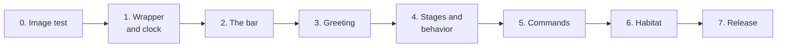

# Roadmap

* What Stray does today, what has been tested, and what comes next.
* A feature is complete only after it has run in a real terminal.
* Last updated October 2, 2026.

## Contents

1. [Status](#status)
2. [Complete](#complete)
3. [Next](#next)
4. [Planned](#planned)
5. [Later Ideas](#later-ideas)
6. [Known Risks](#known-risks)
7. [Open Questions](#open-questions)
8. [Test Record](#test-record)

## Status

| Phase | Goal | Status |
| --- | --- | --- |
| 0 | An image test: a cat running along the bottom rows | Complete |
| 1 | A wrapper you cannot notice, the clock, and `stray stats` | Next |
| 2 | The image check, and the bar with a cat that sits still | Planned |
| 3 | The launch greeting | Planned |
| 4 | Stages, behavior, and resting actions | Planned |
| 5 | Commands to pet, quiet, and name the cat | Planned |
| 6 | The habitat | Planned |
| 7 | A public release | Planned |

* Phase 0 is a throwaway test. Every later phase leaves Stray usable every day.
* A phase is complete when its **Done when** line is true in kitty and in the VS Code terminal, on macOS.

## Complete

### Phase 0: The Image Test

* **Built:** `stray-image-test` in `src/bin/stray-image-test.rs`, a small program with no outside libraries.

1. Asks the terminal whether it can show images, and exits with a message if not.
2. Draws 12 frames of a placeholder cat with smooth edges, and a flipped copy of each.
3. Uploads them and runs the cat along the bottom two rows and back.
4. `--resend` sends the whole picture on every step, to compare if placing by ID flickers.
5. `--dark` draws a dark cat for light backgrounds.
6. q or Ctrl C stops it early and cleans up.

* **How to run:** `cargo run --release --bin stray-image-test`, then again with `-- --resend` and `-- --dark`.

* **Done when:** the cat runs there and back in both terminals with no flicker, no gaps, and nothing left behind.
* **Result:** done in `--resend` mode. Placing by ID works in kitty but not in VS Code. See the [Test Record](#test-record).
* The tmux test moves to Phase 2, on Linux, because tmux is not on the Mac.

## Next

### Phase 1: The Wrapper And The Clock

1. `stray start` runs your shell in a PTY and passes every key and all output through.
2. The inner shell starts as a login shell when the first one was.
3. It handles resizes and exits with the shell's exit code.
4. If it cannot start, it runs your shell directly.
5. If it crashes later, it puts the terminal back to normal and prints one line.
6. The mark holds the name of Stray's PTY, so a leaked copy does not stop a new window from starting Stray.
7. Inside ssh sessions, and inside tmux started from a Stray window, Stray steps aside.
8. It counts time once a minute, once across all windows.
9. `stray stats` shows total hours.
10. `stray install` and `stray uninstall` add and remove the startup line.

* **Done when:**
  * `vim`, Claude Code, tmux, ssh, colors, Ctrl C, and resizing behave the same inside Stray as outside.
  * Everything set in `~/.zprofile`, such as `PATH`, is still there inside Stray.
  * `code .` and a new kitty window opened from a Stray shell both start their own Stray.
  * Typing feels no slower. Printing a large file takes about as long as without Stray.
  * Two windows open for ten minutes add ten minutes, not twenty.

## Planned

### Phase 2: The Bar

* The hardest phase.

1. Run the image check. If it fails, run the shell directly and print the hint once.
2. Reserve the bottom two rows.
3. Color the frames to match the terminal's text.
4. Place a cat that sits still in the home corner.
5. Keep the bar and the cat whole through clears, full screen programs, resets, and resizes.
6. Stop programs from moving the cursor into the bar.
7. Draw only between pieces of output, and wait for batched updates to end.
8. Turn the bar off in windows shorter than 10 rows.
9. Inside tmux, pass image codes through and show the cat with placeholders.

* **Done when:**
  * The bar is correct after `clear`, `vim`, a long build, a Claude Code session, and ten resizes.
  * Scrolling back works as it does without Stray.
  * A program that shows its own images, such as `kitten icat`, and the cat do not disturb each other.
  * tmux started from a Stray window shows one cat, in the window's bar.
  * tmux started on its own shows a whole bar in every pane, and the cats stay put when you switch panes and windows.
  * An ssh session shows one cat, in your own bar.

### Phase 3: The Greeting

1. Add the prompt mark to the bash and zsh setup.
2. Place the cat next to the `>` of the first prompt, only when the space is empty.
3. On the first key, remove the cat and run it fast down to the bar. This is the same at every stage.

* **Done when:** every new window shows the cat at the prompt, and no piece of it is left behind.

### Phase 4: Stages And Behavior

1. Turn hours into a stage.
2. Add the speed setting for testing.
3. Add the modes: hidden, peeking, approaching, home, following, watching, and napping.
4. Read the foreground program.
5. Add the reactions for coding agents, long runs, and failed commands.
6. Add the resting actions: sit, sleep, walk, play, and run.
7. Draw the final frames, about 15 to 18.

* **Done when:**
  * With the speed turned up, the cat goes from scared to bonded in one sitting.
  * Inside Claude Code and `vim`, the cat never leaves the bar.
  * Left alone for ten minutes, a moved in cat does each resting action.

### Phase 5: Commands

1. `stray pet`, once the cat is bonded. It saves the time of the pet, and each window reacts once.
2. `stray sit`, `stray quiet`, `stray hide`, and `stray come`.
3. `stray name`.
4. `stray stats` also shows the stage, the name, and the time until the next stage.

* **Done when:** a command in one window changes the cat in every window within a second.

### Phase 6: The Habitat

1. Unlock one item at 60, 100, and 150 hours.
2. Place the items in the bar. The first is a bed.
3. The cat sleeps in the bed.

* **Done when:** each item appears at its hour and survives everything the bar survives.

### Phase 7: Release

* Publish `stray-cat` on crates.io.
* A README with a short recording.
* A Homebrew package and a license.
* **Done when** a newcomer goes from install to a cat at their prompt in under two minutes.

## Later Ideas

1. Petting with the mouse.
2. The cat stepping out of the bar toward an idle prompt.
3. Trust that fades after a long time away.
4. Other shells, such as fish.
5. Testing iTerm2, Ghostty, and other terminals that pass the image check.

## Known Risks

* Details are in [Hard Parts](ARCHITECTURE.md#hard-parts).

1. VS Code's image support is new. Placing frames by ID fails there, so Stray sends each frame again.
2. The final frames are not drawn, and nobody is chosen to draw them.
3. kitty and VS Code may handle the scroll region differently.
4. Coding agents redraw the screen often.
5. The wrapper may slow typing.
6. Tools that run on Node may show the name `node`.
7. Two rows may be too much in the short VS Code panel.
8. Placeholders inside tmux may only work in kitty.
9. Many tmux panes mean many bars, which may feel crowded.

## Open Questions

1. What are the other plans for the bar?
2. What are the last two habitat items?
3. Should `stray hide` give the two rows back to the shell?
4. Are 30 minutes, 2 hours, 10 hours, and 40 hours the right stage hours?
5. Who draws the final frames?
6. Is two rows tall enough for the cat?

## Test Record

### Phase 0: October 2, 2026, kitty And VS Code

* Run on macOS by the user.

| Terminal | Mode | Frames placed | Result |
| --- | --- | --- | --- |
| kitty | by ID | 215 | The cat ran there and back. |
| kitty | `--resend` | 215 | The cat ran there and back. |
| VS Code, images on | by ID | 285 | The cat showed for about a second, then vanished. The program kept going to the end. |
| VS Code, images on | `--resend` | 285 | The cat ran there and back. |
| VS Code, images off | either | none | It said the terminal cannot show images, and exited. |

* The frame counts differ only because the windows were different widths.
* The cat vanished after about 12 steps, one loop of frames. So in VS Code, removing a frame from the screen also deletes the uploaded picture. After the first loop there is nothing left to place.
* Result: Stray sends the frame with every change instead of placing it by ID. See [Drawing The Cat](ARCHITECTURE.md#drawing-the-cat).
* Not tested: tmux. It moves to Phase 2.

### Phase 0: October 2, 2026, Written Again, No Real Terminal Yet

* The first version was not in this repository, so the image test was written again from the plan above.
* Checked on macOS with no terminal window.

1. `cargo build --release`, `cargo test`, and `cargo clippy` passed with Rust 1.99, with no warnings.
2. The 6 unit tests cover base64, reading the image check reply, the path, the frames, flipping, and the options.
3. Run with no terminal, it said it must run in a terminal window and exited.
4. Not tested: any real terminal. How the cat looks is unknown.
